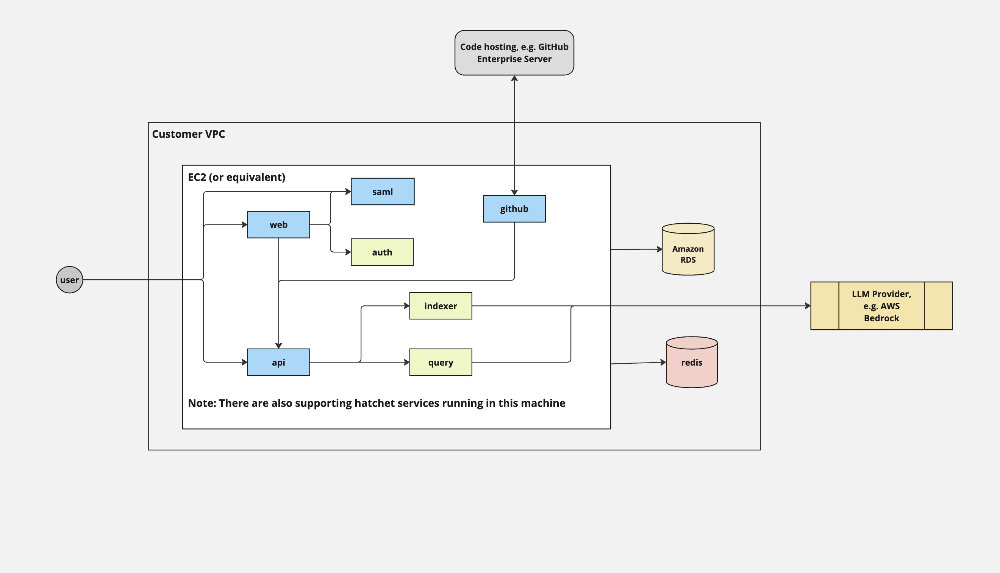
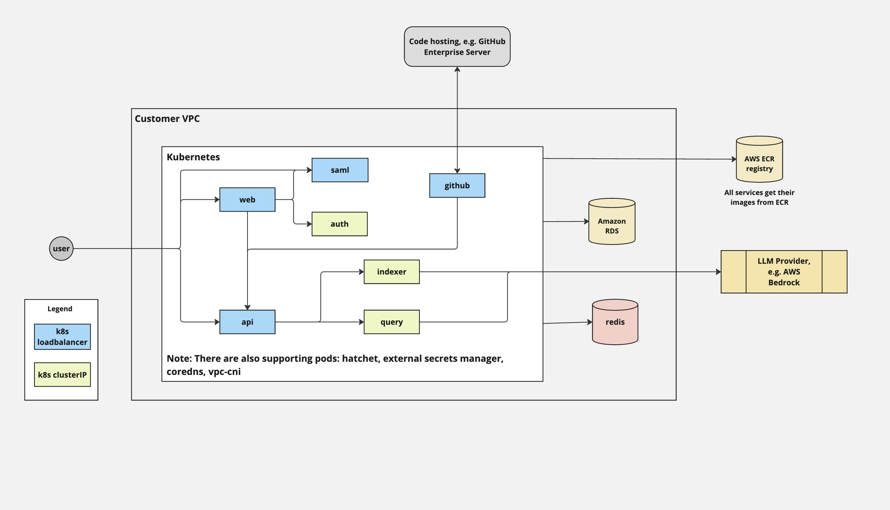

# Greptile Infrastructure

We offer two methods of deployment - `docker-compose` and `kubernetes`. We strongly recommend using the `docker-compose` method as this is simpler and more flexible.

## The onprem setup repository for Greptile (docker-compose)
### Architecture Diagram (docker-compose)
This is a diagram of the architecture.

Follow the `README.md` guide in the `/docker` directory.

You can optionally use the `/docker/terraform` directory to deploy the infrastructure needed to run the docker-compose setup on AWS.

## The onprem setup repository for Greptile (kubernetes)

### Prerequisites

This guide presumes you have working `terraform`, `helm`, and `kubectl` available as a basis.

For AWS we assume `awscli` to be installed with a profile with access to the target account. 

### Setup Guide

Download the latest release from [GitHub](https://github.com/greptileai/akupara). 

Follow the `README.md` guide in the `/kubernetes/terraform` directory.

Once the setup from `/terraform` is complete, continue to deploy the helm chart following the `README.md` in the `/kubernetes/helm` directory.

### Architecture Diagram (kubernetes)
This is a simplified diagram of the architecture.
