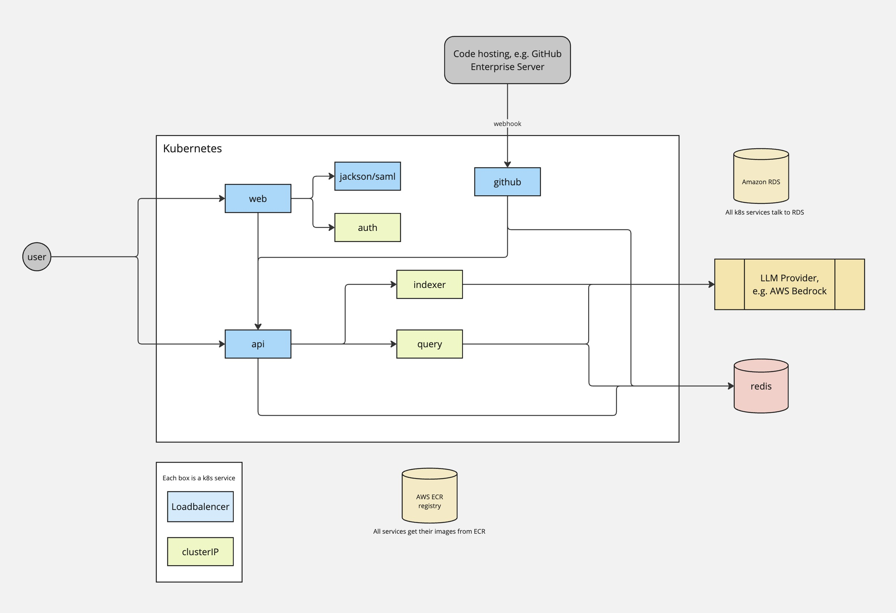

# Greptile Infrastructure

The onprem setup repository for Greptile.

### Prerequisites

This guide presumes you have `terraform`, `helm`, and `kubectl` available as a basis.

For AWS we assume `awscli` to be installed with a profile with access to the target account. 

### Setup Guide

Download the latest release from [GitHub](https://github.com/greptileai/akupara). 

Follow the `README.md` guide in the `/terraform` directory.

Once the setup from `/terraform` is complete, continue to deploy the helm chart following the `README.md` in the `/helm` directory.

### Architecture Diagram
This is a simplified diagram of the architecture.
