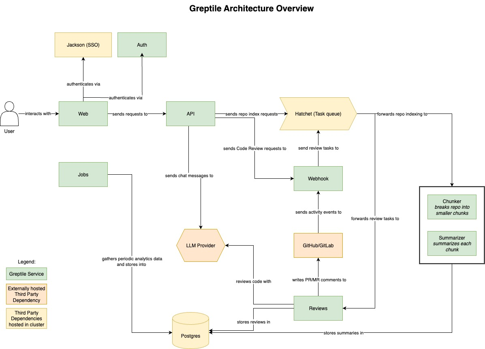

# Greptile Infrastructure

We offer two methods of deployment - `docker-compose` and `kubernetes`. We strongly recommend using the `docker-compose` method as this is simpler and more flexible.

## The onprem setup repository for Greptile (docker-compose)
### Architecture Diagram (docker-compose)
This is a diagram of the architecture.

Follow the `README.md` guide in the `/deploy/docker-compose` directory.

You can optionally use the Terraform stacks to deploy infrastructure needed to run the docker-compose setup on AWS.

## The onprem setup repository for Greptile (kubernetes)

Please check the README.md under `deploy/kubernetes/` on how to deploy Greptile in a Kubernetes cluster.
