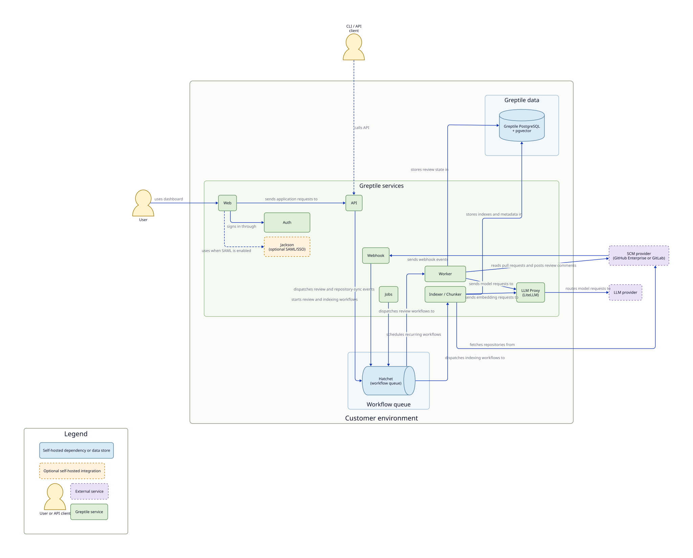

# Greptile Infrastructure

We offer two methods of deployment - `docker-compose` and `kubernetes`. We strongly recommend using the `docker-compose` method as this is simpler and more flexible.

## The onprem setup repository for Greptile (docker-compose)
### Self-hosted architecture



The SVG is generated from `Greptile_architecture.current.d2` with D2 v0.9.0.
TALA is bundled with that release. The renderer exits if another D2 version is
installed, preventing unrelated layout or serialization changes.

Install the exact [D2 v0.9.0 release](https://github.com/d2lang/d2/releases/tag/v0.9.0), then regenerate the SVG:

```bash
bash ./render-architecture.sh
```

Follow the `README.md` guide in the `/deploy/docker-compose` directory.

## The onprem setup repository for Greptile (kubernetes)

Please check the README.md under `deploy/kubernetes/` on how to deploy Greptile in a Kubernetes cluster.
