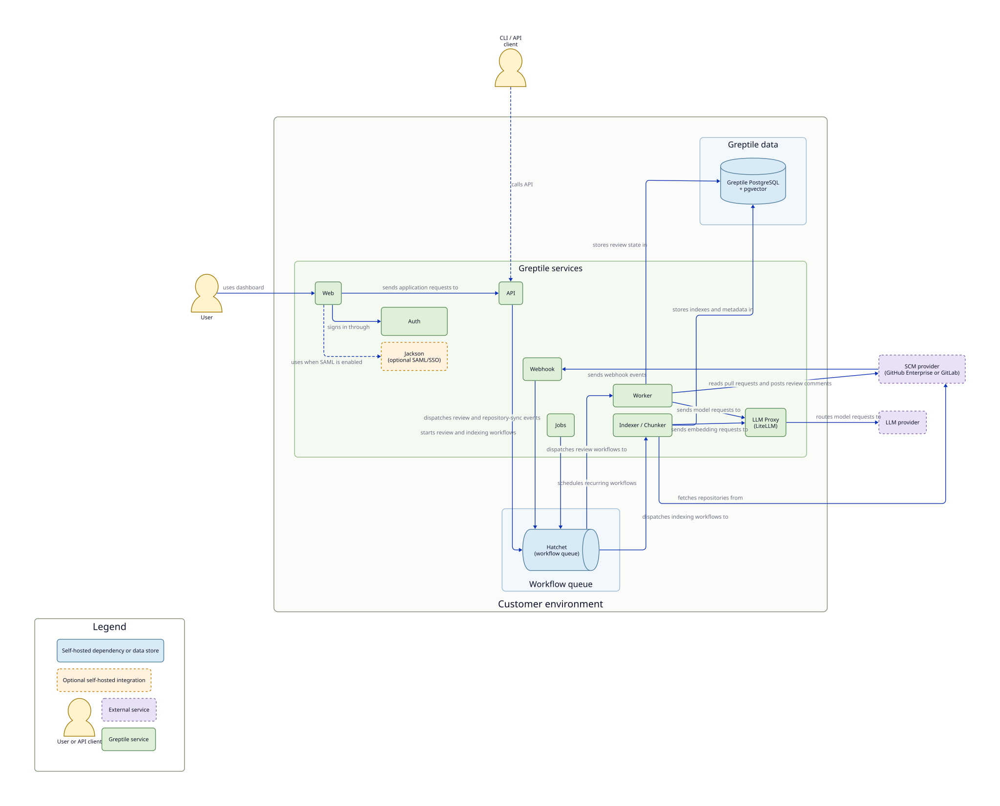

# Self Hosted Greptile

This repository provides deployment artifacts and documentation for self-hosted [Greptile](https://www.greptile.com/). It is intended for operators and IT administrators who install and maintain Greptile in their own environment.

## Architecture

Greptile runs as independently scalable services. The stack depends on Hatchet for task orchestration and PostgreSQL for persistence. See [Architecture overview](docs/reference/architecture.md) for the service list. The following diagram shows the current self-hosted architecture:

## Deployment options
We offer two methods of deployment - `docker-compose` and `kubernetes`.

1. Method via docker-compose: Easy single node setup, suited for smaller teams. See [Install with Docker Compose](docs/installation/docker-compose.md).
2. Method via kubernetes: Enterprise ready setup. See [Install with Kubernetes](docs/installation/kubernetes.md).

## Documentation
- **Installation:** [Requirements](docs/installation/requirements.md) · [Install with Docker Compose](docs/installation/docker-compose.md) · [Install with Kubernetes](docs/installation/kubernetes.md)
- **Configuration:** [Networking](docs/configuration/networking.md) · [GitHub App creation](docs/configuration/github_app_creation.md) · [LLM providers](docs/configuration/llm-providers.md) · [Single sign-on (SSO)](docs/configuration/sso.md)
- **Operations:** [Upgrade](docs/operations/upgrade.md) · [Scaling](docs/operations/scaling.md) · [Troubleshooting](docs/operations/troubleshooting.md) · [Observability](docs/operations/observability.md)
- **Reference:** [Architecture overview](docs/reference/architecture.md)
